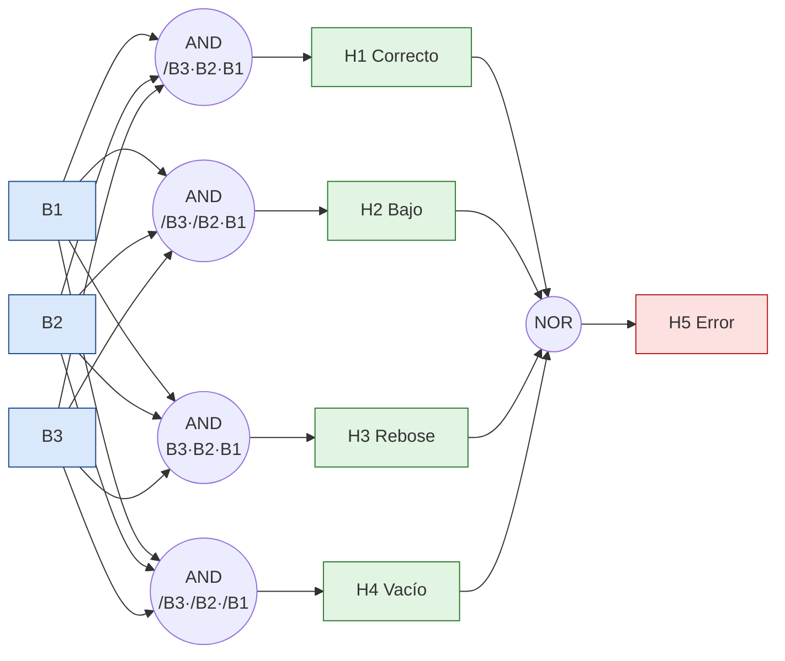

# 1. Análisis y diseño lógico

## 1.1 Enunciado
Se debe automatizar, mediante lógica **Ladder (LD)**, el monitoreo del nivel de un tanque de líquido químico con tres sensores y cinco lámparas de señalización:

- **Sensores:** B1 (nivel inferior), B2 (nivel mínimo) y B3 (rebose). Valor `1` = el líquido alcanza el sensor.
- **Lámparas:** H1 nivel correcto, H2 nivel bajo, H3 nivel alto (rebose), H4 tanque vacío y H5 error.
- **Regla de error:** *si el estado de las señales no tiene sentido por un sensor defectuoso, la lámpara H5 indica un error. El caso en que ninguno de los tres sensores entrega señal **no** se considera error.*

Los tres sensores guardan una relación física jerárquica: si el líquido alcanza B3 (el más alto) necesariamente ya pasó por B2 y B1. Por ello, de las 2³ = 8 combinaciones solo 4 son físicamente válidas.

## 1.2 Tabla de verdad
Se utilizó la herramienta *32x8.com* [[9]](Referencias.md) para verificar y simplificar las funciones.

| # | B3 | B2 | B1 | Interpretación | Salida activa |
|---|:-:|:-:|:-:|---|:-:|
| 0 | 0 | 0 | 0 | Ningún sensor con señal: tanque vacío (no es error) | **H4** |
| 1 | 0 | 0 | 1 | Solo el sensor inferior: nivel bajo | **H2** |
| 2 | 0 | 1 | 0 | B2 sin B1: inconsistente | **H5** |
| 3 | 0 | 1 | 1 | B1 y B2 sin rebose: nivel correcto | **H1** |
| 4 | 1 | 0 | 0 | B3 sin B2 ni B1: inconsistente | **H5** |
| 5 | 1 | 0 | 1 | B3 y B1 sin B2: inconsistente | **H5** |
| 6 | 1 | 1 | 0 | B3 y B2 sin B1: inconsistente | **H5** |
| 7 | 1 | 1 | 1 | Los tres sensores: rebose | **H3** |

## 1.3 Ecuaciones booleanas
Cada salida válida corresponde a un único término producto (mintérmino); no existen términos adyacentes entre salidas distintas que permitan una reducción adicional por mapa de Karnaugh.

```
H4 = /B3 · /B2 · /B1
H2 = /B3 · /B2 ·  B1
H1 = /B3 ·  B2 ·  B1
H3 =  B3 ·  B2 ·  B1
H5 =  B3 · (/B2 + /B1)  +  /B3 · B2 · /B1
```

La salida de error también puede expresarse como el complemento de los cuatro estados válidos:

```
H5 = /H1 · /H2 · /H3 · /H4
```

Ambas formas son equivalentes (se comprobó en las 8 combinaciones). La primera se emplea en CODESYS (con una rama en paralelo) y la segunda en OpenPLC (solo contactos en serie).

## 1.4 Circuito lógico


## 1.5 Naturaleza del proceso
- **Combinacional:** las salidas dependen únicamente del estado actual de B1, B2 y B3; no hay memoria interna.
- **CODESYS:** además de la lógica combinacional se añadió un elemento **controlado por tiempo** (reloj de 1 s con temporizadores TON) que hace parpadear en el HMI las lámparas de rebose y de error.
- **OpenPLC:** el proceso es **controlado por sensores**: cada ciclo de 20 ms se leen las entradas y se recalculan las salidas, de modo que cualquier evento en un sensor se refleja de inmediato en los LED.
