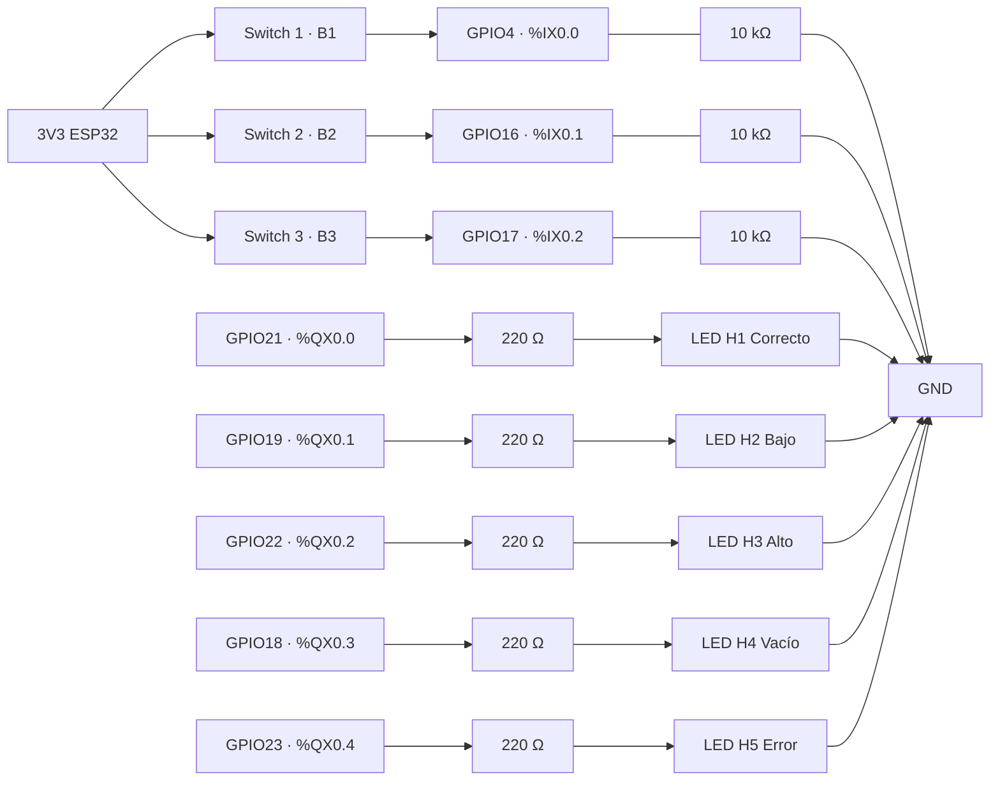

# 6. Montaje físico

El prototipo ejecuta el programa de OpenPLC en una **ESP32 WROOM**. Como no se dispone de sensores de nivel líquido, B1, B2 y B3 se simulan con un **DIP switch** (mismo principio que los botones del HMI en CODESYS) y las lámparas H1–H5 son **LED** reales.

## 6.1 Componentes
| Cant. | Componente | Función |
|:-:|---|---|
| 1 | ESP32 WROOM DevKit (30 pines, CP2102) [[6]](Referencias.md) | Controlador con el runtime de OpenPLC |
| 5 | LED indicadores (verde, amarillos y rojo) | Lámparas H1–H5 |
| 5 | Resistencia 220–330 Ω | Limitación de corriente de cada LED (en serie con el ánodo) |
| 1 | DIP switch de 4 posiciones (se usan 3) | Simulación de los sensores B1, B2 y B3 |
| 3 | Resistencia 10 kΩ | Pull-down externo de cada entrada |
| 3 | Resistencia 330 Ω (opcional) | Protección en serie entre cada switch y su GPIO |
| 1 | Protoboard y cables de conexión | Montaje y GND común |

## 6.2 Esquema de conexiones

## 6.3 Conexiones
**Entradas (sensores simulados).** Cada posición del DIP switch une dos patas opuestas. Para cada switch usado: una pata a **3,3 V** (opcionalmente a través de 330 Ω) y, en la misma fila, el GPIO correspondiente con una resistencia de **10 kΩ a GND**. Con el switch apagado el GPIO lee `0`; con el switch encendido lee `1`, lo que coincide con los contactos normalmente abiertos del Ladder sin necesidad de invertir señales.

**Salidas (LED).** GPIO → resistencia 220–330 Ω → ánodo (pata larga) → cátodo (pata corta) → GND.

**GND común.** Switches, LED y resistencias comparten la misma línea de GND, conectada a un pin GND físico de la ESP32.

| Función | Pin placa | GPIO | Dirección IEC |
|---|---|:-:|---|
| B1 (sensor inferior) | D4 | 4 | `%IX0.0` |
| B2 (nivel mínimo) | RX2 | 16 | `%IX0.1` |
| B3 (rebose) | TX2 | 17 | `%IX0.2` |
| H1 (nivel correcto) | D21 | 21 | `%QX0.0` |
| H2 (nivel bajo) | D19 | 19 | `%QX0.1` |
| H3 (nivel alto) | D22 | 22 | `%QX0.2` |
| H4 (tanque vacío) | D18 | 18 | `%QX0.3` |
| H5 (error) | D23 | 23 | `%QX0.4` |

## 6.4 Por qué un pull-down externo
El firmware que genera OpenPLC configura las entradas como `INPUT` simple, **sin pull-up interno** (`pinMode(pin, INPUT)`). Con el switch abierto el pin quedaba flotante y producía lecturas erráticas: LED parpadeando o un LED fijo en un estado incorrecto (por ejemplo, Error). La solución fue conectar el switch a 3,3 V y añadir una resistencia de 10 kΩ a GND en cada entrada, de modo que el estado abierto sea un `0` definido.

## 6.5 Carga del programa
1. En OpenPLC Editor, seleccionar la placa **ESP32 WROOM** y el puerto COM de la ESP32.
2. *Compilar* y *Subir*.
3. Si aparece `Wrong boot mode detected (0x13)`: mantener **BOOT**, pulsar y soltar **EN**, lanzar la carga con BOOT presionado y soltarlo cuando comience la transferencia. Otras causas posibles: cable USB solo de carga, puerto COM ocupado.

## 6.6 Fotografías del montaje
Las fotografías de cada estado se encuentran en [Validación con hardware](OpenPLC-Validacion.md).
